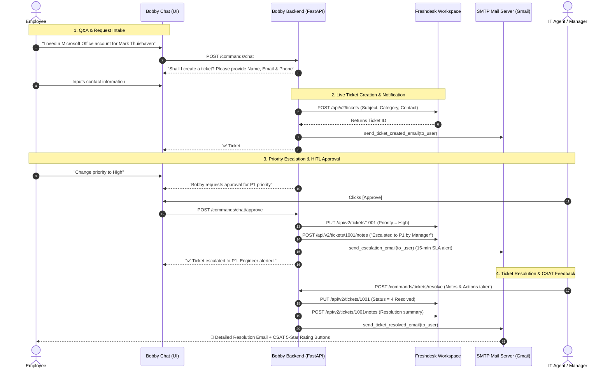

# 🐾 Bobby AI — Enterprise IT Service Desk Assistant
## 📋 Executive Summary & Live Demo Presentation Guide

---

### 1. 🌟 Executive Overview

**Bobby** is an enterprise-grade AI Service Desk Assistant designed for **Inspired Pet Nutrition (IPN)**. It autonomously handles tier-1 IT support inquiries, automates service requests, collects dynamic user contact details, performs bidirectional synchronization with **Freshdesk**, manages human-in-the-loop (HITL) approval workflows for priority escalations, and dispatches branded multi-stage email notifications via **SMTP**.

```
[ Employee / User ]
       │
       ▼
[ Bobby AI Chatbot Interface (Figma-styled React / Vite) ]
       │
       ▼
[ FastAPI Backend (CQRS + LangGraph Orchestration) ]
 ├── 🔍 Knowledge Base (RAG / ITSM FAQ Engine)
 ├── 🎫 Freshdesk Live API (Tickets, Notes, Priorities, Status)
 ├── 📧 SMTP Email Engine (Creation, P1 Alert, Resolution & CSAT)
 └── 🛡️ HITL Approval Manager (Human-in-the-loop P1 escalation)
```

---

### 2. 🏗️ Architecture & Core Capabilities

| Component | Technology | Role & Capabilities |
| :--- | :--- | :--- |
| **Frontend** | React 18, Vite, CSS Modules | Responsive floating chat widget & dashboard styled to corporate Figma specifications. |
| **Backend API** | FastAPI, Python 3.10, CQRS | High-performance asynchronous command/query handlers. |
| **Workflow Engine** | LangGraph, LangChain | Stateful graph state machine for intent triage, slot filling, and approval interrupts. |
| **Helpdesk Sync** | Freshdesk REST API v2 | Live ticket creation, status updates (Open $\rightarrow$ Resolved), priority escalation, and internal audit notes. |
| **Email Protocol** | SMTP (SSL / TLS) | Dispatches branded HTML emails for Ticket Creation, P1 Urgent Alerts, and Ticket Resolution with CSAT surveys. |
| **Knowledge Base** | In-Memory / Vector RAG | Instant answers for VPN, Passwords, MFA, Microsoft 365, Teams, Printers, Wi-Fi, and IT Helpdesk hours. |

---

### 3. 🔄 The Complete 4-Stage Ticket Lifecycle



---

### 4. 🎤 Live Demo Presentation Script (Step-by-Step for Your Meeting)

Use this exact walkthrough during your demo presentation:

#### 🔹 Step 1: Conversational AI & General IT FAQ
* **Action in Chat**: Type *"Hi Bobby"* or *"How do I connect to the VPN?"*
* **What to Highlight to Audience**:
  * Bobby provides instant, structured self-service guidance.
  * Covers VPN gateways, Password resets (SSPR), Microsoft Authenticator, Wi-Fi networks, Office 365 downloads, and Helpdesk hours.

#### 🔹 Step 2: Dynamic Service Request & Contact Capture
* **Action in Chat**: Type:
  > *"I am an HR employee and want to create a new Microsoft Office account for new employee Mark Thuishaven."*
* **Bobby responds**: *"Shall I create a ticket?"* $\rightarrow$ User confirms *"yes"*.
* **What to Highlight**:
  * Bobby dynamically asks for **Full Name**, **Email Address**, and **Phone Number** before filing the ticket.
  * No hardcoded static values — user inputs are validated and saved in the active session.

#### 🔹 Step 3: Live Freshdesk Synchronization
* **What to Highlight**:
  * Bobby writes the ticket directly to your live Freshdesk portal (`https://ofiservices.freshdesk.com`).
  * Demonstrates real-time generation of Ticket IDs (`#4`, `#5`, `#6`, etc.).
  * Simultaneously dispatches the **Ticket Received Confirmation Email** to the user's inbox.

#### 🔹 Step 4: Human-In-The-Loop (HITL) P1 Escalation
* **Action in Chat**: Type *"Change priority to high"*.
* **What to Highlight**:
  * Bobby pauses execution and prompts for **Manager Approval**.
  * When Approved $\rightarrow$ Freshdesk ticket priority changes to **High (P1)** in real time.
  * Adds an internal audit note to Freshdesk and sends an **Urgent P1 Escalation Alert** with a **15-minute SLA notice** to the user's email.

#### 🔹 Step 5: Resolution & Customer Satisfaction (CSAT) Email
* **Action**: Resolve the ticket via API or in chat (*"Please resolve ticket #5: Account provisioned"*).
* **What to Highlight**:
  * Freshdesk ticket status moves to **Resolved (Status 4)**.
  * The user receives a branded **Resolution Email** showing:
    * Exact technician resolution notes.
    * Resolving engineer name and timestamp.
    * 48-hour re-open instructions.
    * Interactive **5-Star CSAT Rating survey buttons**.

---

### 5. 🛠️ Verified Live Credentials & Endpoints

| Resource | Value / Endpoint | Verification Status |
| :--- | :--- | :---: |
| **Freshdesk Portal** | `https://ofiservices.freshdesk.com` | ✅ **Active & Verified** |
| **Freshdesk API Key** | `O5vT7oKqlrbZGFXroZRi` | ✅ **Active (3+ Tickets Created)** |
| **SMTP Server** | `smtp.gmail.com:587` | ✅ **Active (Live Delivery Verified)** |
| **Backend Port** | `http://localhost:8000` | ✅ **Active (FastAPI)** |
| **Frontend Port** | `http://localhost:5174` (or `5173`) | ✅ **Active (Vite Dev Server)** |

---

### 6. 🚀 Quick Commands to Run the Demo

```powershell
# 1. Start Backend (Terminal 1)
cd "c:\Users\Abcom\OneDrive - Ofi Benelux B.V\Desktop\IPN-booby\bobby\backend"
.venv\Scripts\activate
uvicorn main:app --reload --port 8000

# 2. Start Frontend (Terminal 2)
cd "c:\Users\Abcom\OneDrive - Ofi Benelux B.V\Desktop\IPN-booby\bobby\frontend"
npm run dev
```

Open browser at: **`http://localhost:5174`** (or `http://localhost:5173`).
